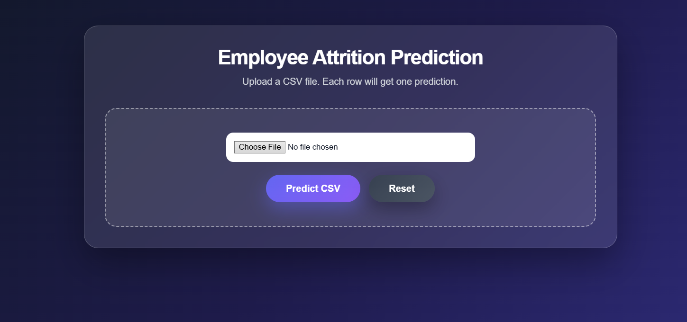
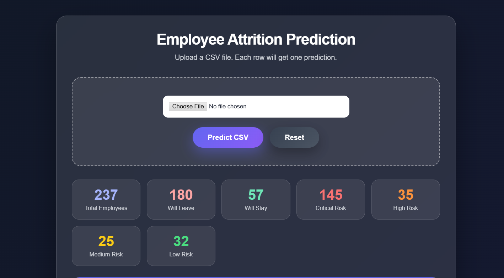
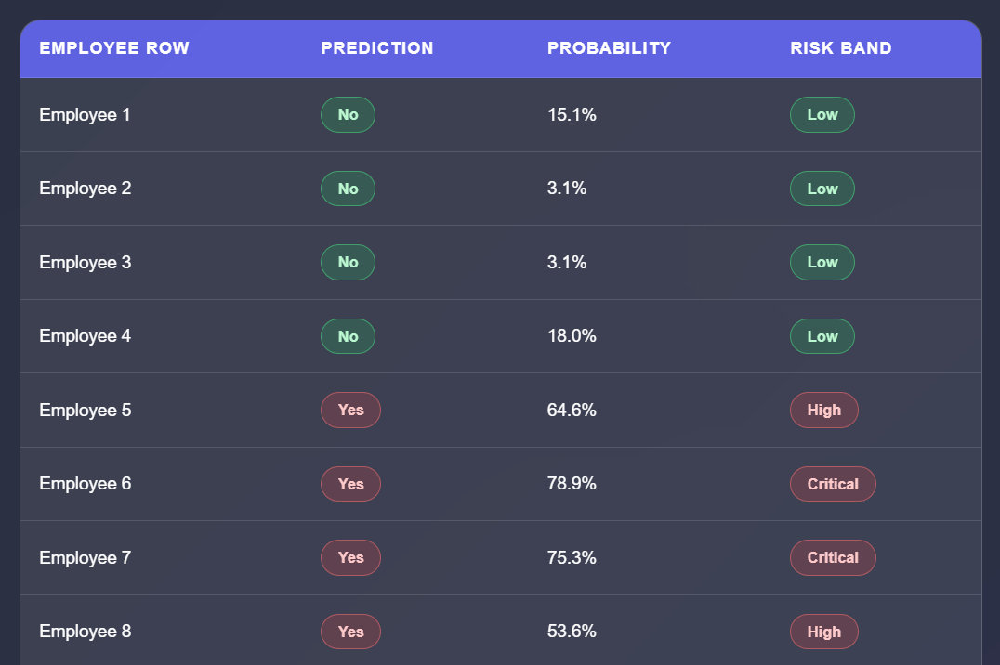

# Employee Attrition Prediction System

Predict employee attrition before they resign, disappear, and suddenly become “open to work.”

This project uses Machine Learning to identify employees at risk of leaving based on HR data, helping companies act early instead of pretending they were shocked.

---

## Project Preview







---

## Features 🚀

* Data cleaning and preprocessing
* Multi-method outlier detection
* Feature engineering from HR patterns
* Ridge vs Lasso Logistic Regression battle
* Class imbalance handling using SMOTE + Tomek
* Threshold optimization using F1-score
* Employee risk segmentation
* Export trained model with Pickle
* Django web integration for predictions

---

## Tech Stack 🛠️

* Python 3.10+
* Pandas
* NumPy
* Scikit-learn
* Imbalanced-learn
* Django
* Jupyter Notebook

---

## Project Structure 📁

```bash
attrition_project/
│── attrition_project/
│── predictor/
│── images/
│   ├── IMG1.png
│   ├── IMG2.png
│   └── IMG3.png
│── Testing Data/
│── HR.csv
│── Model_Code.py
│── attrition_model.pkl
│── manage.py
│── requirements.txt
│── README.md
```

---

# Full Setup Guide (0 to Hero) ⚡

## 1. Install Python

Download Python:

https://www.python.org/downloads/

During installation:

* Check **Add Python to PATH**
* Ignore fear
* Continue installation

Verify:

```bash
python --version
```

---

## 2. Clone Repository

```bash
git clone https://github.com/Abdou-Moumen/Employee-Attrition-Prediction-System.git
cd Employee-Attrition-Prediction-System
```

---

## 3. Create Virtual Environment

### Windows

```bash
python -m venv venv
venv\Scripts\activate
```

### Mac / Linux

```bash
python3 -m venv venv
source venv/bin/activate
```

If successful, your terminal now wears `(venv)` like a badge of honor.

---

## 4. Install Dependencies

```bash
pip install --upgrade pip
pip install pandas numpy scikit-learn imbalanced-learn django jupyter matplotlib seaborn
```

Or simply:

```bash
pip install -r requirements.txt
```

---

## 5. Generate requirements.txt

```bash
pip freeze > requirements.txt
```

---

## 6. Launch Jupyter Notebook

```bash
jupyter notebook
```

Then open:

```bash
notebooks/attrition.ipynb
```

---

## 7. Run Django Web App

```bash
python manage.py runserver
```

Visit:

```bash
http://127.0.0.1:8000/
```

Where predictions happen and spreadsheets fear you.

---

## 8. Run the ML Workflow

Inside notebook:

* Load HR dataset
* Detect suspicious outliers
* Engineer better features
* Compare Ridge vs Lasso
* Evaluate metrics
* Save best model

---

## Saved Model 🧠

```bash
attrition_model.pkl
```

Load it later:

```python
import pickle

with open("attrition_model.pkl", "rb") as f:
    model = pickle.load(f)
```

---

## Metrics Used 📊

* Accuracy
* Precision
* Recall
* F1 Score
* ROC AUC

Because one metric alone is how bad decisions are made.

---

## Why This Project Matters 💼

Hiring is expensive. Losing talent is worse.

This system helps HR teams identify attrition risk early and take action before resignation emails arrive at 8:03 AM.

---

## Future Improvements 🔥

* XGBoost / LightGBM
* SHAP Explainability
* Streamlit Dashboard
* Real-time HR Analytics API
* Cloud Deployment

---

## Author 👨‍💻

Built by someone who looked at messy HR data and took it personally.
